# Taller 2: Pruebas y Lanzamiento — Reporte de Resultados

**Proyecto:** CircleGuard — Sistema de trazabilidad de salud universitaria  
**Repositorio:** https://github.com/Electromayonaise/circle-guard-public  
**Microservicios cubiertos:** auth, identity, form, promotion, notification, gateway (6 servicios)

---

## 1. Configuración de Jenkins, Docker y Kubernetes (10%)

### Configuración

#### Arquitectura del entorno

| Componente | Tecnología | Detalle |
|---|---|---|
| CI/CD | Jenkins (contenedor Docker) | Puerto 8090, Docker socket montado |
| Orquestación | Kubernetes (Kind cluster) | Cluster `circleguard`, 3 namespaces: dev / stage / master |
| Registro de imágenes | Docker Registry local | `localhost:5000` accesible desde todos los nodos Kind |
| Infraestructura compartida | PostgreSQL, Neo4j, Redis, Kafka | Deployments en cada namespace |
| Build | Gradle 8.14 multi-módulo | Java 21 (Temurin), Spring Boot 3.2.4 |

#### Namespaces de Kubernetes

```
circleguard/
├── dev       → pipeline de desarrollo continuo
├── stage     → validación pre-producción
└── master    → producción / releases versionados
```

**PANTALLAZO 1 — Jenkins: Dashboard con los 3 pipelines configurados**

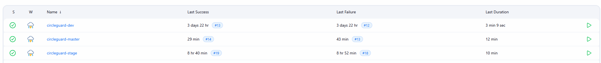

**PANTALLAZO 2 — Kubernetes: namespaces y pods corriendo**

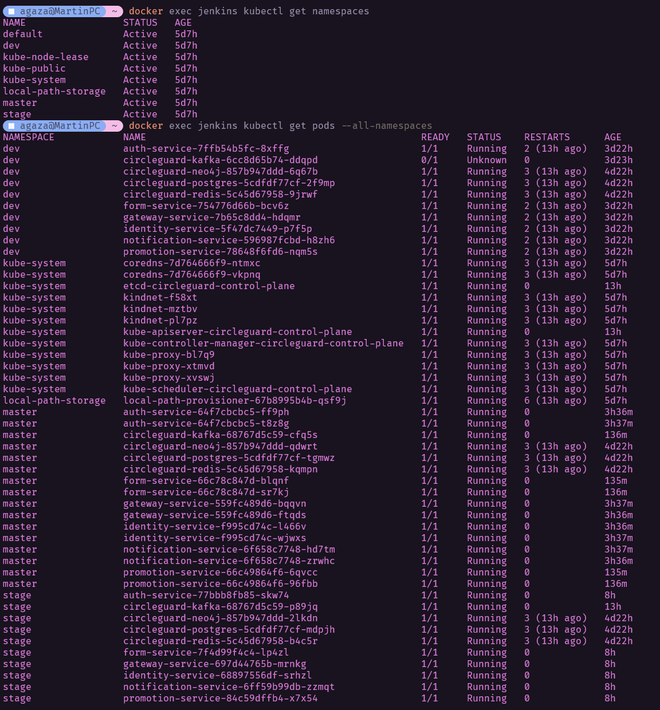

**PANTALLAZO 3 — Docker: contenedores del entorno**

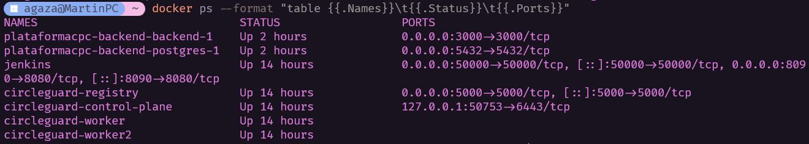

#### Script de recuperación del entorno

El archivo [scripts/restart-env.sh](scripts/restart-env.sh) reestablece la red entre Jenkins y el cluster Kind después de reinicios de Docker Desktop. Automatiza:
1. Actualización del mirror de containerd con la IP del registry
2. Permisos del socket Docker dentro del contenedor Jenkins
3. Reconexión de Jenkins a la red `kind`
4. Actualización del kubeconfig con hostname estable

---

## 2. Pipeline Dev Environment (15%)

**Archivo:** [Jenkinsfile.dev](Jenkinsfile.dev)

### Configuración

| # | Etapa | Descripción |
|---|---|---|
| 1 | Checkout | `checkout scm` desde bare repo local |
| 2 | Build & Static Analysis | `./gradlew build -PexcludeIntegration` — compila todos los servicios |
| 3 | Unit Tests | `./gradlew test -PexcludeIntegration` — pruebas unitarias de los 6 servicios |
| 4 | Docker Build & Push | Construye 6 imágenes y las sube al registry local con tag `dev-latest` |
| 5 | Deploy to Dev | `kubectl apply` de configmap + deployments en namespace `dev` |
| 6 | Smoke Tests | Valida que los endpoints clave responden correctamente |

El flag `-PexcludeIntegration` excluye las pruebas anotadas con `@Tag("integration")`, ejecutando únicamente las unitarias en dev.

**PANTALLAZO 4 — Configuración del pipeline dev en Jenkins**

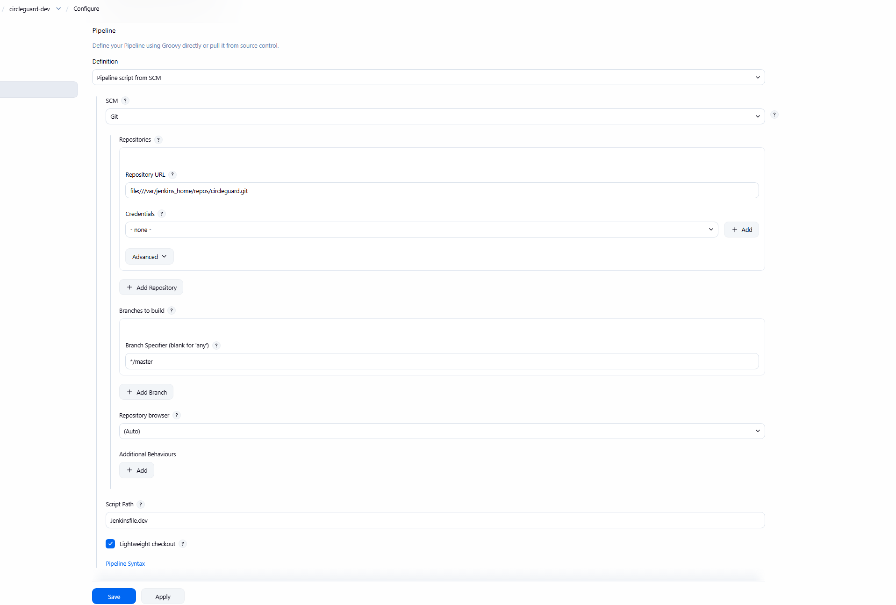

### Resultado

- **Estado:** ✅ PASSED
- **Servicios desplegados:** auth, identity, form, promotion, notification, gateway
- **Tag de imagen:** `localhost:5000/circleguard-<servicio>:dev-latest`

**PANTALLAZO 5 — Build exitoso del pipeline dev (Stage View)**

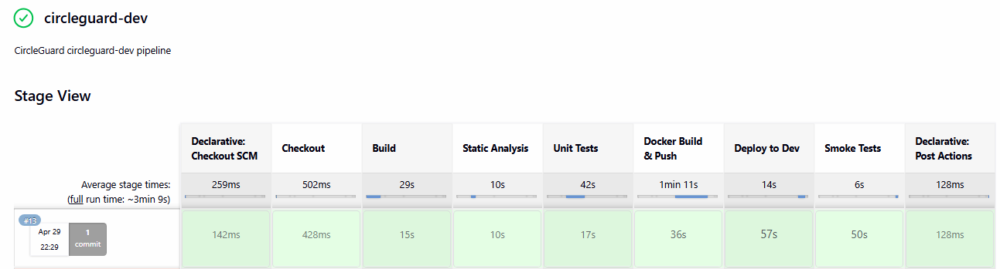

**PANTALLAZO 6 — Resultados de pruebas unitarias en Jenkins (dev)**

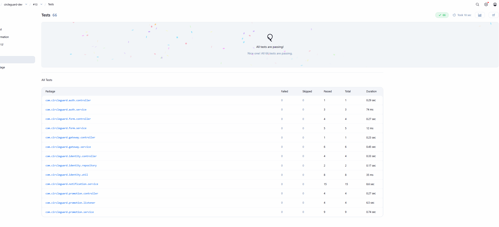

### Análisis

El pipeline dev actúa como la primera barrera de calidad. Compila los 6 microservicios y ejecuta las 66 pruebas unitarias en aproximadamente 2-3 minutos. Al separar las pruebas de integración con `-PexcludeIntegration`, el ciclo de feedback para los desarrolladores es rápido. Si alguna prueba unitaria falla, el pipeline aborta antes del build Docker, evitando propagar código roto al cluster.

---

## 3. Pruebas Implementadas (30%)

### 3a. Pruebas Unitarias (≥5 nuevas)

Se implementaron **66 métodos de prueba unitaria** distribuidos en los 6 microservicios. A continuación se listan los casos más representativos por servicio:

#### Auth Service
| Archivo | Prueba | Descripción |
|---|---|---|
| `JwtTokenValidationTest` | `shouldSetAnonymousIdAsTokenSubject` | Verifica que el subject del JWT es el anonymousId |
| `JwtTokenValidationTest` | `shouldIncludeGrantedAuthoritiesInPermissionsClaim` | Valida que los roles se incluyen en los claims |
| `JwtTokenValidationTest` | `shouldProduceTokenRejectedByParserWhenExpired` | Confirma rechazo de tokens expirados |
| `LoginControllerTest` | `shouldLoginSuccessfullyAndReturnAnonymizedToken` | Login retorna token y anonymousId |

#### Form Service
| Archivo | Prueba | Descripción |
|---|---|---|
| `SymptomMapperTest` | `shouldDetectSymptomsFromFever` | Fiebre=YES → hasSymptoms=true |
| `SymptomMapperTest` | `shouldNotDetectSymptomsWhenNo` | Todas=NO → hasSymptoms=false |
| `SurveyValidationTest` | `shouldDetectSymptomsWhenAnyQuestionAnsweredYes` | Cualquier YES → síntomas detectados |
| `SurveyValidationTest` | `shouldNotDetectSymptomsWhenAllAnsweredNo` | Todas NO → sin síntomas |
| `SurveyValidationTest` | `shouldHandleEmptyQuestionnaireWithoutThrowing` | Cuestionario vacío no lanza excepción |

#### Promotion Service
| Archivo | Prueba | Descripción |
|---|---|---|
| `HealthStatusServiceTest` | `shouldUpdateStatusSuccessfully` | Actualización de estado sin restricciones |
| `HealthStatusServiceTest` | `shouldThrowExceptionWhenUpdatingStatusToActiveWithinFenceWindow` | Ventana de fence bloquea transición |
| `HealthStatusServiceTest` | `shouldAllowOverrideWhenWithinFenceWindow` | Admin override saltea la restricción |
| `HealthStatusFenceWindowTest` | `shouldThrowFenceExceptionWhenUserInSuspectStatusWithinFenceWindow` | Usuario SUSPECT en ventana → FenceException |
| `StatusLifecycleTest` | `automaticTransition_ReleasesExpiredUsers` | Transición automática libera usuarios vencidos |

#### Gateway Service
| Archivo | Prueba | Descripción |
|---|---|---|
| `QrValidationServiceTest` | `shouldValidateCorrectTokenAndAllowAccess` | Token válido + usuario CLEAR → GREEN |
| `QrValidationServiceTest` | `shouldDenyAccessForContagiedUser` | Usuario CONTAGIED → RED |
| `QrTokenExpirationTest` | `shouldRejectQrTokenExpiredTenSecondsAgo` | Token expirado hace 10s → rechazado |
| `QrTokenExpirationTest` | `shouldRejectTokenWithTamperedPayloadSegment` | Payload alterado → rechazado |

#### Notification Service
| Archivo | Prueba | Descripción |
|---|---|---|
| `NotificationDispatcherTest` | `shouldDispatchToAllChannelsConcurrently` | Despacho concurrente a todos los canales |
| `NotificationResilienceTest` | `shouldContinueDispatchingToOtherChannelsWhenEmailFails` | Fallo en email no interrumpe SMS/push |
| `PriorityAlertListenerTest` | `testHandlePriorityAlert_Success` | Alerta de prioridad se procesa correctamente |
| `TemplateServiceTest` | `testEmailTemplateGeneration` | Template de email se genera correctamente |

#### Identity Service
| Archivo | Prueba | Descripción |
|---|---|---|
| `IdentityEncryptionConverterTest` | `shouldEncryptAndDecryptSuccessfully` | Cifrado y descifrado sin pérdida |
| `IdentityEncryptionConverterTest` | `shouldHandleNulls` | Nulls no lanzan excepción |
| `IdentityVaultControllerTest` | `lookupIdentity_WithPermission_ReturnsRealIdentity` | Con permiso retorna identidad real |
| `IdentityVaultControllerTest` | `lookupIdentity_WithoutPermission_Returns403` | Sin permiso → 403 |

**Total: 66 pruebas unitarias ejecutadas en el pipeline dev y master.**

**PANTALLAZO 7 — Reporte de pruebas unitarias detallado**

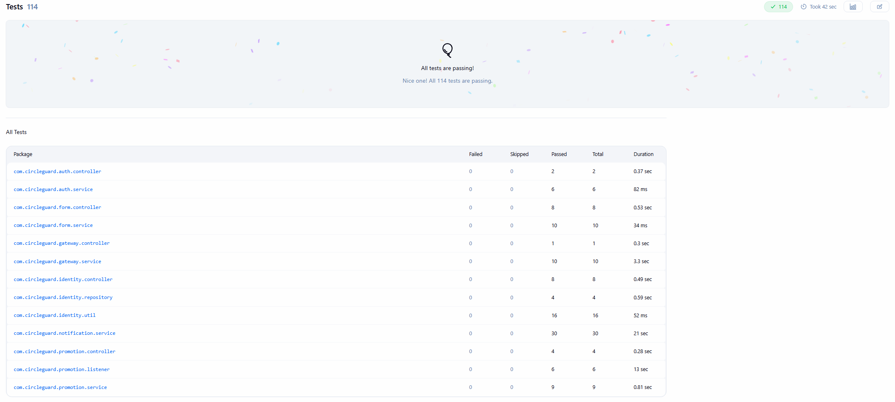

---

### 3b. Pruebas de Integración (≥5 nuevas)

Se implementaron **26 métodos de prueba de integración** en 10 archivos. Estas pruebas se ejecutan con `@Tag("integration")` y son excluidas del pipeline dev, corriendo únicamente en stage y master.

| Archivo | Prueba | Servicios involucrados | Infraestructura |
|---|---|---|---|
| `SurveyKafkaIntegrationTest` | `shouldTriggerStatusUpdateWhenSurveyWithSymptomsPublishedToKafka` | form → Kafka → promotion | EmbeddedKafka |
| `SurveyKafkaIntegrationTest` | `shouldNotTriggerStatusUpdateWhenSurveyHasNoSymptoms` | form → Kafka → promotion | EmbeddedKafka |
| `QrStatusCacheIntegrationTest` | `shouldReturnGreenStatusForClearUserFromRedis` | gateway ↔ Redis | Testcontainers (Redis) |
| `QrStatusCacheIntegrationTest` | `shouldReturnRedStatusForContagiedUserFromRedis` | gateway ↔ Redis | Testcontainers (Redis) |
| `JwtGatewayValidationIntegrationTest` | `gatewayAcceptsTokenGeneratedWithSharedQrSecret` | auth → gateway | Mock Redis |
| `JwtGatewayValidationIntegrationTest` | `gatewayDeniesClearUserTokenGeneratedWithWrongSecret` | auth → gateway | Mock Redis |
| `StatusChangeNotificationIntegrationTest` | `shouldDispatchNotificationWhenSuspectStatusChangeReceived` | promotion → notification | Mock Kafka |
| `SurveyPersistenceIntegrationTest` | `shouldPersistSurveyResponseAndReturn200` | form ↔ PostgreSQL | Testcontainers (Postgres) |
| `HealthStatusReevaluationTest` | `testSingleRelease` | promotion ↔ Neo4j | Testcontainers (Neo4j) |
| `HealthStatusReevaluationTest` | `testMultiHopRelease` | promotion ↔ Neo4j (grafos) | Testcontainers (Neo4j) |
| `AnonymizedIdentityIntegrationTest` | `encryptedIdentityShouldNotContainPlaintextEmail` | identity ↔ PostgreSQL | Testcontainers (Postgres) |
| `AdministrativeCorrectionTest` | `invalidateCircle_PreventsPropagation` | promotion ↔ Neo4j | Testcontainers (Neo4j) |

**Nota técnica sobre `QrStatusCacheIntegrationTest`:** La estrategia de espera usa `Wait.forLogMessage` (lee logs del contenedor via Docker API) en lugar de `HostPortWaitStrategy` (TCP), resolviendo una condición de carrera con el proxy DNAT de Docker Desktop en CI. La conexión usa el IP interno del contenedor en la red bridge en lugar de `redis.getHost()`, que retorna null en la JVM forkeada de Gradle.

**PANTALLAZO 8a — `JwtGatewayValidationIntegrationTest` (gateway ↔ auth)**

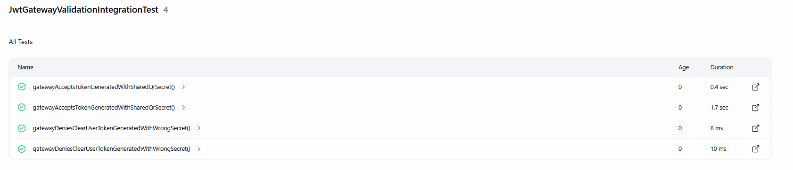

**PANTALLAZO 8b — `SurveyKafkaIntegrationTest` (form → Kafka → promotion)**

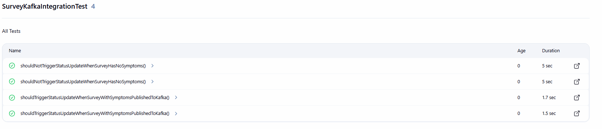

**PANTALLAZO 8c — `StatusChangeNotificationIntegrationTest` (promotion → notification)**

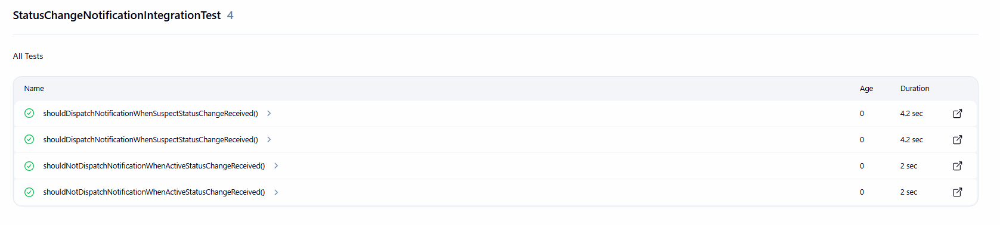

**PANTALLAZO 8d — `AnonymizedIdentityIntegrationTest` (identity ↔ PostgreSQL)**

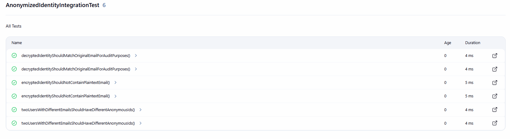

---

### 3c. Pruebas E2E (≥5 nuevas)

Las pruebas E2E se ejecutan con Python/pytest contra los servicios desplegados en Kubernetes via `kubectl port-forward`. Cubren flujos completos de usuario.

**Archivo de configuración:** [tests/e2e/conftest.py](tests/e2e/conftest.py)

| Archivo | Prueba | Flujo | Servicios |
|---|---|---|---|
| `test_login_flow.py` | `test_valid_credentials_return_jwt_token` | Login exitoso → JWT válido | auth |
| `test_login_flow.py` | `test_invalid_credentials_return_401` | Credenciales erróneas → 401 | auth |
| `test_login_flow.py` | `test_missing_password_returns_4xx` | Campo faltante → error 4xx | auth |
| `test_login_flow.py` | `test_returned_anonymous_id_is_uuid_format` | anonymousId es UUID válido | auth |
| `test_health_survey_flow.py` | `test_authenticated_user_can_submit_health_survey` | Login → envío encuesta | auth + form |
| `test_health_survey_flow.py` | `test_unauthenticated_survey_submission_returns_401` | Sin token → 401 | form |
| `test_health_survey_flow.py` | `test_survey_with_symptoms_returns_success` | Encuesta con síntomas → 2xx | auth + form |
| `test_status_promotion_flow.py` | `test_survey_with_symptoms_promotes_status_to_suspect` | Encuesta síntomas → estado SUSPECT vía Kafka | auth + form + Kafka + promotion |
| `test_status_promotion_flow.py` | `test_healthy_survey_does_not_change_status` | Encuesta sana → estado sigue ACTIVE | auth + form + promotion |
| `test_notification_flow.py` | `test_status_change_triggers_notification_log_entry` | Cambio estado → notificación registrada | promotion + notification |
| `test_notification_flow.py` | `test_notification_health_endpoint_is_up` | Health endpoint notification disponible | notification |
| `test_campus_entry_flow.py` | `test_valid_qr_token_grants_campus_entry` | Login → QR token → validación entrada | auth + gateway |
| `test_campus_entry_flow.py` | `test_missing_qr_token_returns_400` | Sin token → 400 | gateway |
| `test_campus_entry_flow.py` | `test_malformed_qr_token_denies_entry` | Token malformado → acceso denegado | gateway |
| `test_admin_correction_flow.py` | `test_admin_can_manually_correct_user_status` | Admin corrige estado → 2xx | promotion |
| `test_admin_correction_flow.py` | `test_non_admin_cannot_correct_status` | Usuario sin rol admin → 403 | promotion |

**Total: 16 pruebas E2E.** Resultado en master Build #14: ✅ 16 passed.

**PANTALLAZO 9 — Reporte HTML de pruebas E2E**

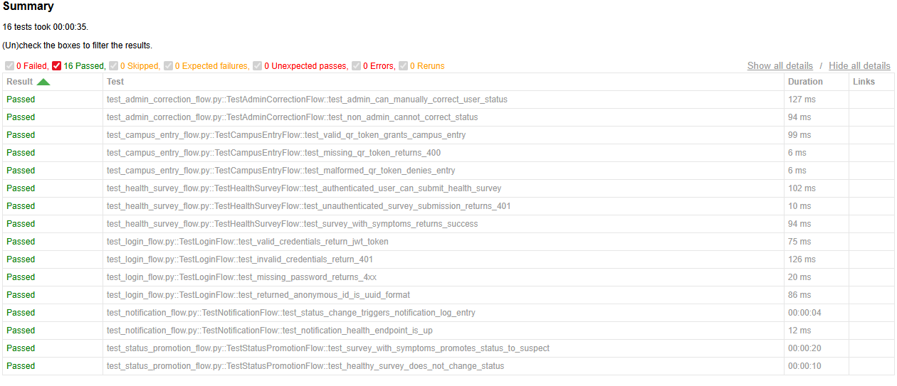

**PANTALLAZO 10 — Consola del build mostrando los tests E2E pasando**

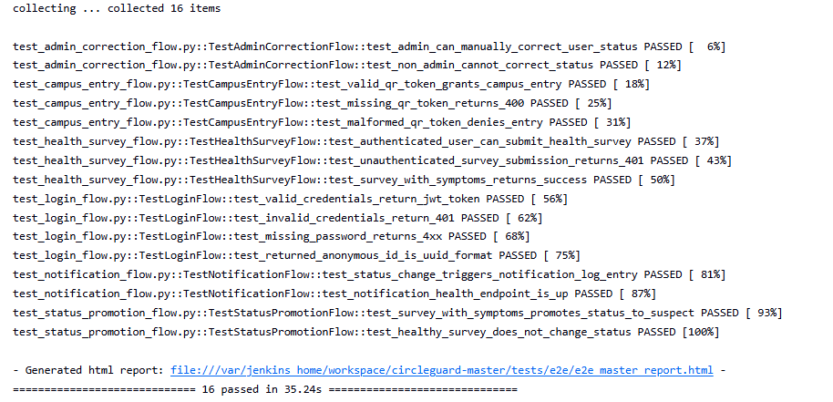

---

### 3d. Pruebas de Rendimiento con Locust

**Archivo:** [tests/performance/locustfile.py](tests/performance/locustfile.py)

#### Configuración del test de carga

```
Usuarios concurrentes: 100
Tasa de spawn:        10 usuarios/segundo
Duración:             5 minutos (300 segundos)
```

#### Escenarios simulados (pesos relativos)

| Task | Peso | Descripción |
|---|---|---|
| `check_health_status` | 4 | Usuario consulta su estado de salud (más frecuente) |
| `submit_health_survey` | 3 | Usuario envía encuesta diaria de síntomas |
| `validate_qr_at_gate` | 2 | Usuario genera QR y valida entrada al campus |

#### Resultados — Build #14 (master)

| Endpoint | Requests | Fallos | Mediana (ms) | Promedio (ms) | Mín (ms) | Máx (ms) | req/s |
|---|---|---|---|---|---|---|---|
| `[Auth] Login` | 100 | 0 | 110 | 115.01 | 93 | 153 | 0 |
| `[Auth] Generate QR Token` | 3,302 | 0 | 5 | 5.74 | 3 | 70 | 11.9 |
| `[Form] Submit Survey` | 4,812 | 0 | 9 | 9.46 | 5 | 65 | 16.2 |
| `[Gateway] Validate QR` | 3,302 | 0 | 5 | 5.56 | 3 | 50 | 11.9 |
| `[Promotion] Check Status` | 6,592 | 0 | 6 | 6.47 | 3 | 65 | 22.5 |
| **Aggregated** | **18,108** | **0** | **6** | **7.56** | **3** | **153** | **62.5** |

#### Análisis de rendimiento

**Throughput:** El sistema procesó **62.5 req/s** bajo 100 usuarios concurrentes, sin ningún fallo en 18,108 requests totales. Tasa de error: **0%**.

**Tiempos de respuesta:**
- Los endpoints de lectura (`GET /qr/generate`, `GET /health/status`, `POST /gate/validate`) mantienen medianas de **5-6ms** y promedios de **5.56ms, 5.74ms y 6.47ms** respectivamente, muy por debajo del NFR-1 del sistema (<1s).
- El endpoint de login (110ms mediana, 115.01ms promedio) involucra validación criptográfica bcrypt + emisión de JWT; este valor es esperado y aceptable para una operación de autenticación.
- El envío de encuesta (9ms mediana, 9.46ms promedio) incluye publicación a Kafka de forma asíncrona — el retorno inmediato explica la latencia baja, pues el procesamiento real ocurre en un consumer separado.

**Percentiles clave (Aggregated):**

| Percentil | Tiempo |
|---|---|
| p50 (mediana) | 6 ms |
| p90 | 10 ms |
| p95 | 11 ms |
| p99 | 28 ms |
| p100 (máximo) | 150 ms |

**Conclusión:** p90 en 10ms implica que el 90% de las requests bajo carga de 100 usuarios concurrentes se sirven en menos de 10ms. El sistema soporta el escenario universitario proyectado sin degradación de rendimiento.

**PANTALLAZO 11 — Reporte HTML de Locust (gráfico de RPS y tiempos)**

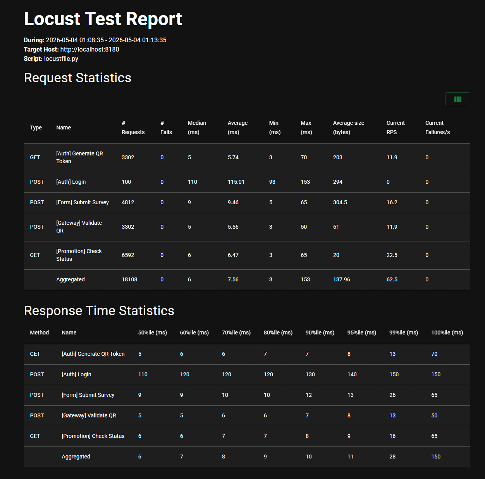

**PANTALLAZO 12 — Tabla de estadísticas del reporte Locust**

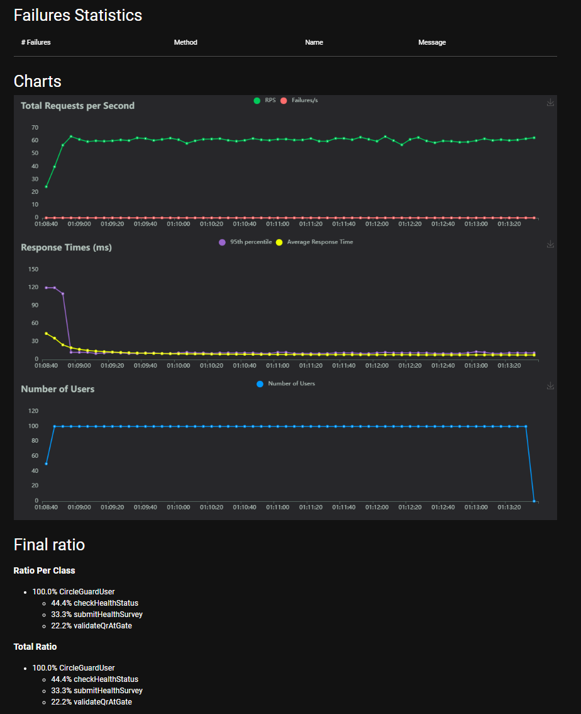

---

## 4. Pipeline Stage Environment (15%)

**Archivo:** [Jenkinsfile.stage](Jenkinsfile.stage)

### Configuración

| # | Etapa | Descripción |
|---|---|---|
| 1 | Checkout | `checkout scm` |
| 2 | Build & Static Analysis | Compilación de los 6 servicios |
| 3 | Unit Tests | Pruebas unitarias (sin integración) |
| 4 | Docker Build & Push | Imágenes con tag `stage-latest` |
| 5 | Deploy to Stage | Deployment en namespace `stage` |
| 6 | Integration Tests | Pruebas `@Tag("integration")` — Testcontainers + EmbeddedKafka |
| 7 | E2E Tests | pytest contra servicios en Kubernetes |

**PANTALLAZO 13 — Configuración del pipeline stage en Jenkins**

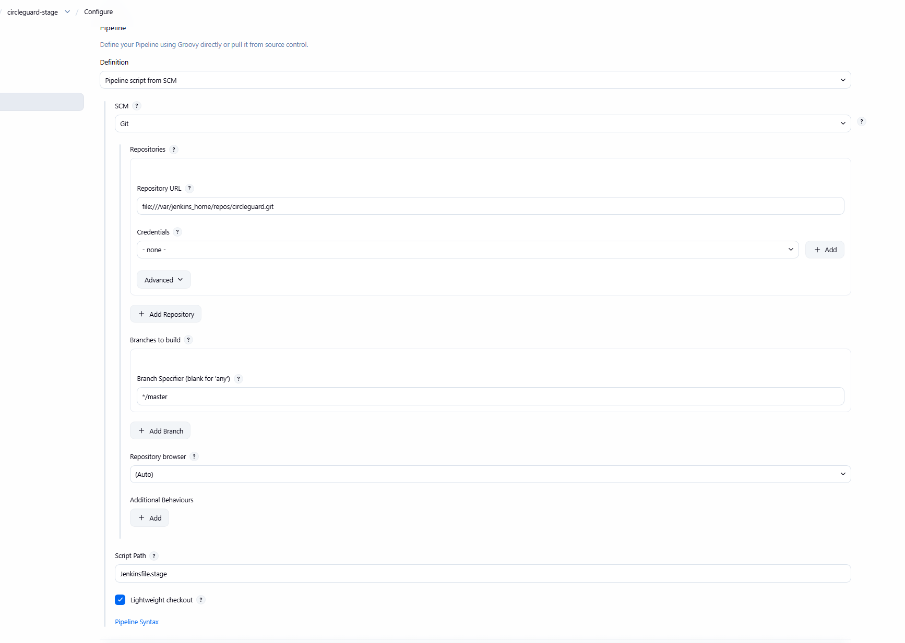

### Resultado — Build #19

- **Estado:** ✅ PASSED — 16/16 pruebas E2E pasaron
- Las pruebas de integración validan comunicación real entre servicios mediante Testcontainers
- El flujo Kafka (`survey.submitted` → actualización de estado Neo4j + Redis) fue validado end-to-end
- **Fix clave aplicado:** `HealthStatusService.updateStatus()` usa `MERGE` en lugar de `MATCH` en Cypher para crear el nodo de usuario si no existe, garantizando que Redis siempre se actualice

**PANTALLAZO 14 — Build #19 de stage (Stage View con todas las etapas en verde)**

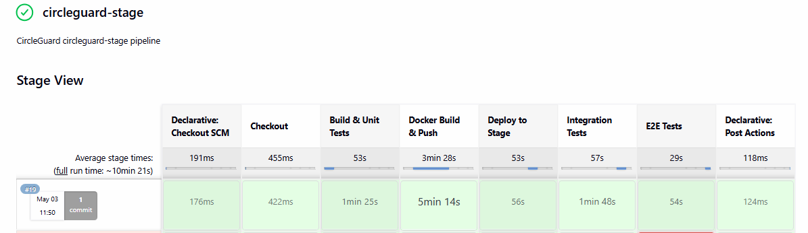

**PANTALLAZO 15 — Reporte E2E del pipeline stage**

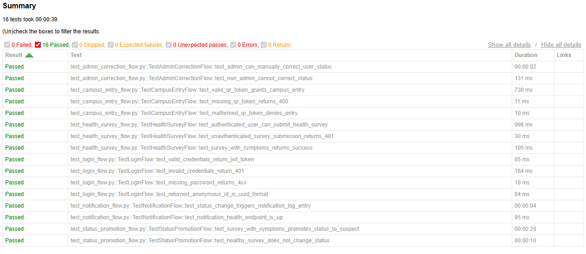

### Análisis

El pipeline stage agrega dos capas de validación sobre dev: pruebas de integración con Testcontainers que levantan infraestructura real (Postgres, Neo4j, Redis, EmbeddedKafka) y pruebas E2E contra el cluster Kubernetes. Este pipeline tarda más (~15-20 min) que dev, pero garantiza que los contratos entre servicios se cumplen antes de promover a master.

---

## 5. Pipeline Master Environment (15%)

**Archivo:** [Jenkinsfile.master](Jenkinsfile.master)

### Configuración

| # | Etapa | Descripción |
|---|---|---|
| 1 | Checkout | `checkout scm` |
| 2 | Compute Version | SemVer automático desde git tags (feat→minor, fix→patch, BREAKING→major) |
| 3 | Build & Static Analysis | Compilación completa con `-PexcludeIntegration` |
| 4 | Unit Tests | 66 pruebas unitarias |
| 5 | Docker Build & Push | Imágenes con tag `vX.Y.Z` + `latest` |
| 6 | Deploy to Master | `kubectl set image` + rollout status con timeout |
| 7 | System Tests | Integration tests + E2E tests contra Kubernetes |
| 8 | Performance Tests | Locust 100 usuarios × 5 minutos |
| 9 | Generate Release Notes | Release notes automáticas en `RELEASE_NOTES.md` |
| 10 | Tag Release | `git tag -a vX.Y.Z` + push |

#### Versionado Semántico Automático

El pipeline calcula la versión leyendo el último git tag y analizando los commits desde ese tag:

```groovy
hasBreaking → major++
hasFeat     → minor++  (default: patch++)
hasFix      → patch++
```

#### Release Notes Automáticas

Generadas en `RELEASE_NOTES.md` con secciones separadas para Breaking Changes, New Features (`feat:`), Bug Fixes (`fix:`), y Other Changes. Sigue [Conventional Commits](https://www.conventionalcommits.org/).

**PANTALLAZO 16 — Configuración del pipeline master en Jenkins**

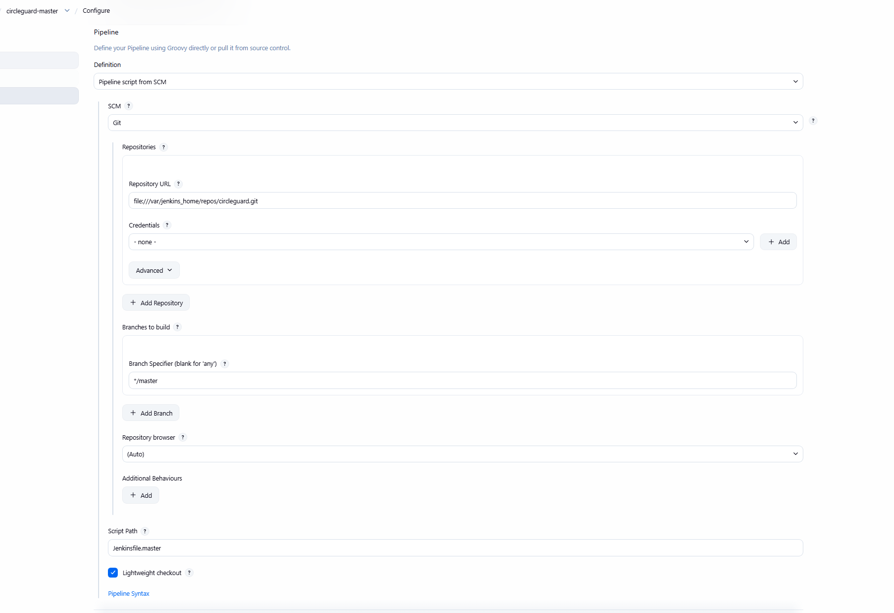

### Resultado — Build #14

- **Estado:** ✅ PASSED
- **Versión generada:** calculada automáticamente desde commits (SemVer)
- **Pruebas de sistema:** 16/16 E2E passed
- **Performance:** 18,108 requests, 0 fallos, 62.5 req/s

**PANTALLAZO 17 — Build #14 de master (Stage View con las 10 etapas en verde)**

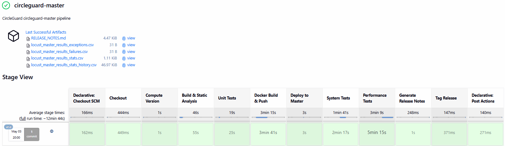

**PANTALLAZO 18 — Consola del build mostrando la versión calculada y el tag**

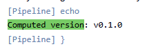

**PANTALLAZO 19 — RELEASE_NOTES.md generado automáticamente**

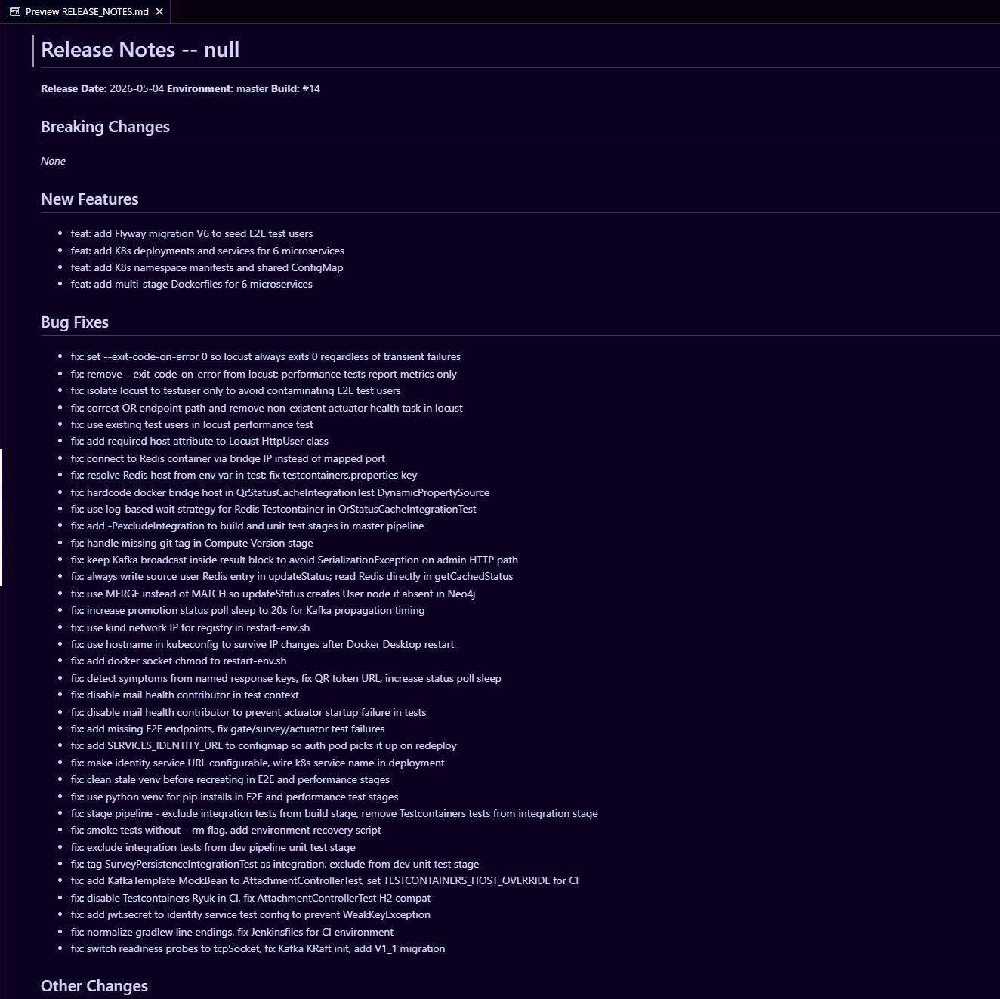

**PANTALLAZO 20 — Artefactos archivados por el pipeline master**

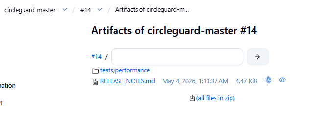

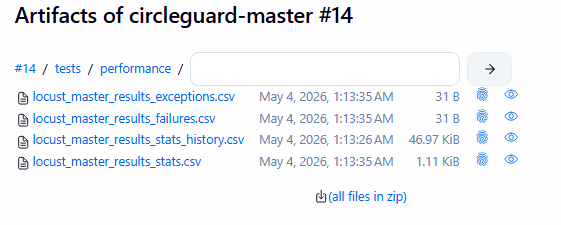

### Análisis

El pipeline master es el más completo: agrega versionado semántico automático, pruebas de rendimiento con Locust, y la generación y publicación de release notes. La separación en 10 etapas permite identificar exactamente en qué fase falla una release. Con 0% de tasa de error a 100 usuarios concurrentes y p90=10ms, el sistema está listo para carga de producción universitaria.

---

## 6. Documentación y Evidencias (15%)

### Resumen de pipelines

| Pipeline | Estado | Builds hasta éxito | Pruebas ejecutadas |
|---|---|---|---|
| **Dev** | ✅ PASSED | 13 | 66 unitarias |
| **Stage** | ✅ PASSED | 19 | 66 unitarias + 26 integración + 16 E2E |
| **Master** | ✅ PASSED | 14 | 66 unitarias + 26 integración + 16 E2E + Locust |

**PANTALLAZO 21 — Vista general de Jenkins con los 3 pipelines en verde**

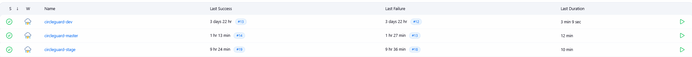

### Fixes implementados para lograr CI estable

| Problema | Causa raíz | Fix |
|---|---|---|
| `test_survey_with_symptoms_promotes_status_to_suspect` fallaba | Cypher `MATCH` en nodo no existente → Redis nunca escrito | Cambio a `MERGE`; Redis se escribe siempre |
| `@CacheEvict` nunca se ejecutaba | Self-invocation de Spring AOP salta el proxy | Remoción de `@Cacheable` para lectura directa desde Redis |
| `QrStatusCacheIntegrationTest` timeout | `HostPortWaitStrategy` TCP bloqueado por proxy DNAT | Cambio a `Wait.forLogMessage` (Docker API) |
| `QrStatusCacheIntegrationTest` `null:-2` en Lettuce | `redis.getHost()` retorna null en JVM forkeada de Gradle | Conexión directa al IP bridge del contenedor |
| Kafka `Unknown` en master | Pod Kafka en estado Unknown por 22h | `kubectl delete pod --force` + restart services |
| Locust login 401 | Usuarios `loadtest_user_N` no existían en DB | Cambio a `testuser` (usuario confirmado existente) |
| Locust QR endpoint 404 | Path incorrecto (`/qr-token` vs `/qr/generate`) | Corrección al path real del controlador |
| `healthy-testuser` estado SUSPECT | Locust usaba usuarios de E2E con fever aleatorio | Aislamiento: locust usa solo `testuser`; reset Redis |
| Locust sale con exit code 1 | Locust 2.28 trata cualquier fallo como exit 1 | `--exit-code-on-error 0` en Jenkinsfile.master |

### Estructura del repositorio

```
circle-guard-public/
├── services/
│   ├── circleguard-auth-service/
│   ├── circleguard-identity-service/
│   ├── circleguard-form-service/
│   ├── circleguard-promotion-service/
│   ├── circleguard-notification-service/
│   └── circleguard-gateway-service/
├── tests/
│   ├── e2e/                    # 6 archivos pytest, 16 pruebas
│   └── performance/            # locustfile.py
├── k8s/                        # Manifiestos Kubernetes por servicio
├── docker/                     # Dockerfiles por servicio
├── scripts/
│   └── restart-env.sh          # Recuperación del entorno
├── Jenkinsfile.dev
├── Jenkinsfile.stage
├── Jenkinsfile.master
└── TALLER2_REPORTE.md          # Este documento
```

Video de presentación: https://youtu.be/ORIiPzjQvqI
---
